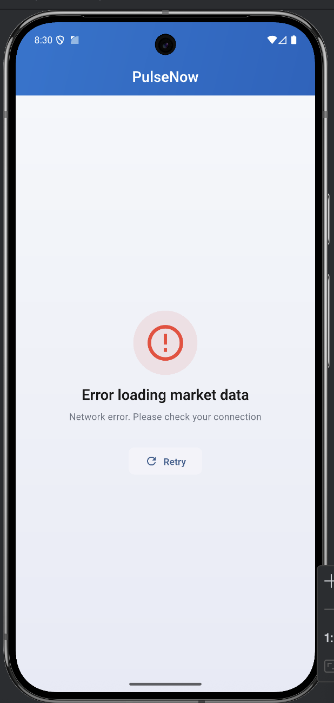
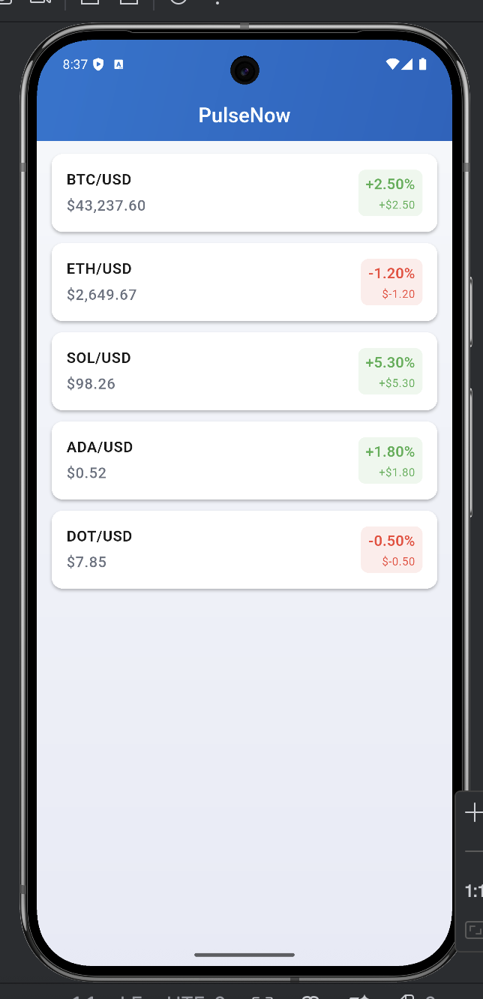
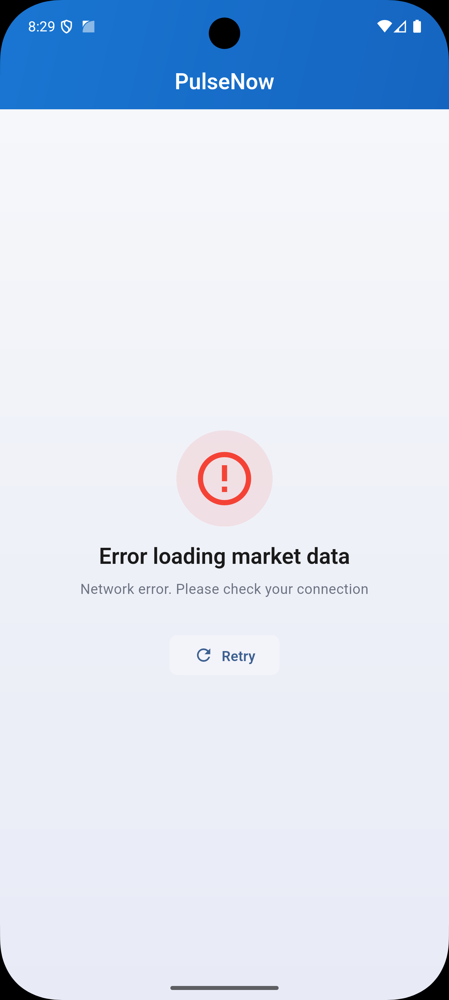
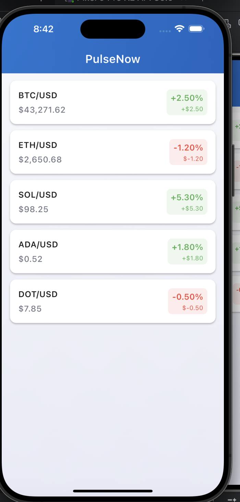

# PulseNow Flutter Developer Assessment

This repository contains the take-home assessment for the Flutter Developer position at PulseNow.

## Results

The app has been tested on both iOS and Android platforms with proper error handling:

### Android Emulator

**Error State** - When backend is not accessible:

*Error handling screen showing "Network error. Please check your connection" with retry button*

**Success State** - Market data loaded successfully:

*Market data displayed successfully on Android emulator*

**Features visible:**
- List of cryptocurrency pairs (BTC/USD, ETH/USD, SOL/USD, ADA/USD, DOT/USD)
- Current prices formatted as currency
- 24h change percentages with color coding (green for positive, red for negative)
- Clean card-based UI with rounded corners
- Pull-to-refresh functionality
- Error state with retry functionality

### iOS Simulator

**Error State** - When backend is not accessible:

*Error handling screen showing "Network error. Please check your connection" with retry button*

**Success State** - Market data loaded successfully:

*Market data displayed successfully on iOS simulator with color-coded price changes*

**Features visible:**
- List of cryptocurrency pairs with prices
- Formatted currency and percentage displays
- Green/red color coding for positive/negative changes
- Loading states and error handling with retry functionality
- Native iOS design patterns

## Quick Start

### 1. Start the Backend

```bash
cd backend
npm install
npm start
```

The backend will run on `http://localhost:3000`

### 2. Start the Flutter App

```bash
cd flutter_app
flutter pub get
flutter run
```

**Note**: For Android emulator, update `lib/core/constants/app_constants.dart` to use `10.0.2.2` instead of `localhost`.

## Features Implemented

- ✅ Market data display with crypto symbols, prices, and 24h changes
- ✅ Color-coded price changes (green for positive, red for negative)
- ✅ Loading states, error handling with retry, and empty state
- ✅ Pull-to-refresh support
- ✅ Clean Architecture with Repository pattern
- ✅ Provider-based state management
- ✅ Comprehensive error handling with custom Failure types

## Project Structure

```
flutter_app/lib/
├── core/          # Interfaces, errors, constants, theme
├── data/          # Repository and data source implementations
├── models/        # Data models
├── presentation/  # UI screens and widgets
├── providers/     # State management
└── utils/         # Utility functions (formatters)
```

## Code Quality

**Linting**: 80+ lint rules enabled with strict type checking (`flutter_app/analysis_options.yaml`)

**Running Lint Checks:**
```bash
cd flutter_app
flutter analyze
dart fix --apply  # Auto-fix issues
```

**Key Rules**: Type safety, const constructors, package imports, Flutter best practices

## Testing

**Test Suite**: Unit tests and widget tests included

**Running Tests:**
```bash
cd flutter_app
flutter test                    # Run all tests
flutter test --coverage        # With coverage
flutter test test/models/...   # Specific file
```

**Test Coverage:**
- ✅ `MarketDataFormatter` - All formatting functions
- ✅ `MarketData` model - JSON parsing, validation, serialization
- ✅ `MarketDataListItem` - UI display and formatting
- ✅ `LoadingWidget` - Loading indicator
- ✅ `PulseNowApp` - App initialization

## Backend API

- `GET /api/market-data` - Returns list of crypto symbols with prices and 24h changes

See `backend/README.md` for full API documentation.

## Assessment Details

See `ASSESSMENT.md` for detailed requirements and evaluation criteria.

## Questions?

Contact the hiring team if you have any questions.

Good luck! 🚀
